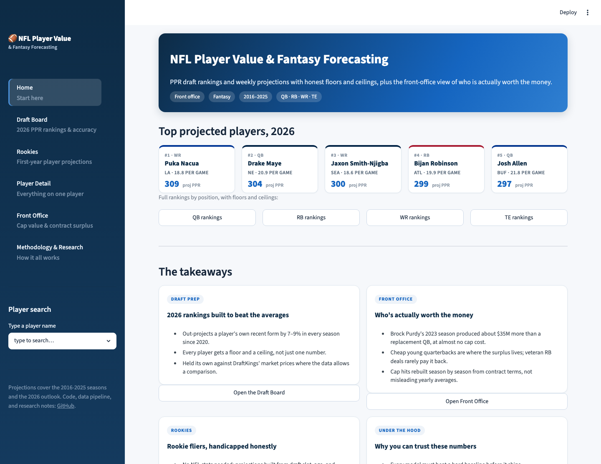

# NFL Player Value & Fantasy Forecasting

[](https://github.com/kylelevesque12/nfl-player-value-analysis/actions/workflows/tests.yml)

Ten years of nflverse data, three questions: how much is a player actually worth to a front office, can a weekly fantasy model consistently beat the naive baselines every forecast is measured against, and what do the negative results teach about model architecture.

A Streamlit app ties the research threads together: a Home overview, a single-section sidebar (Player Value & Cap, Fantasy Rankings, Rookies, QB Injury Study, Methodology & Sources), a full in-app Project Report, and a global player search → unified player detail view. Every section pairs a plain-language explanation with its tool. The complete plain-language write-up lives in [`PROJECT_REFERENCE.md`](PROJECT_REFERENCE.md). Run it locally with `./run_app.sh` (see [Interactive dashboard](#interactive-dashboard)).



## Four results worth knowing

The weekly fantasy projector cuts RMSE 7-9% below the naive forecasting baselines, a player's recent-form and season-to-date averages, the standard bar any forecast must clear ([Hyndman & Athanasopoulos](https://otexts.com/fpp3/accuracy.html)), and that edge holds in every season from 2020 through 2025, including the most recent. That margin is meaningful because weekly fantasy scoring is intrinsically low-predictability (single-digit to low-twenties R² by position, per [Fantasy Football Analytics](https://fantasyfootballanalytics.net/2024/12/which-fantasy-football-projections-are-most-accurate.html)). On the 2020-2021 window where a free market-implied benchmark exists, the model is also competitive-to-slightly-ahead of a DraftKings-implied projection (6.386 vs 6.493 RMSE on 11,191 matched player-weeks), though that comparison can't be extended to recent years without paid projection data, so it is not the headline claim. Snap-share features did most of the work; the TE position flipped from a negative to a positive skill score the moment they were added. ([External benchmark](report/external_benchmark.md) · [feasibility note](report/fantasy/external_projection_benchmark_feasibility.md))

Brock Purdy's 2023 season produced about $37M of surplus over a replacement-level QB on a rookie deal, the largest single-season cap surplus in 2016-2025. Three of the top ten surplus seasons are rookie-deal QBs (Purdy 2023, Purdy 2024, Jayden Daniels 2024). The RB market shows a negative implicit price for value at the position level, consistent with the long-documented RB market inefficiency. ([Replacement-level findings](report/salary_efficiency_findings.md))

The "QB1 goes down, WR1 craters" story does not survive a careful DiD. With treatment defined as the formal Out designation, a parallel-trends-checked DiD finds a null effect: the QB plays through a developing injury for weeks before being ruled out, so by the time the Out flag triggers, receiver production has already declined. Re-timing treatment to the first week the starter appears on the injury report at all surfaces a modest, suggestive effect the Out-only design missed (ATT ≈ −0.58 PPG, p ≈ 0.04), with about 104 events, real but underpowered, not the dramatic collapse fans assume. ([Causal write-up](report/causal/qb_injury_session3.md))

Bayesian hierarchical rookie projections (PyMC, non-centered, partial pooling across positions) hit near-nominal posterior interval coverage in every rookie class. An early version silently dropped rookies drafted behind a veteran starter (they had NaN targets and disappeared from training). The current hurdle model handles this: stage 1 predicts whether a rookie plays meaningfully; stage 2 predicts production conditional on playing; the product is the projection. A small incumbent-context signal correctly lowers the projected playing time of a rookie stuck behind an established starter, rather than excluding him silently. ([Rookie Bayes](report/rookie_bayes_projection.md) · [Hurdle model](report/rookie_hurdle_projection.md))

## Where to start

The project covers three audiences. Pick the section that matches yours:

| Audience | Section | Top deliverable |
| --- | --- | --- |
| NFL team analytics / cap analysts | [Front office](#front-office-perspective) | Replacement-level surplus framework with Brock Purdy at #1 |
| ESPN / DraftKings / FantasyPros | [Fantasy / DFS](#fantasy--dfs-perspective) | Weekly projector: 7-9% RMSE edge over naive baselines every season 2020-2025; competitive with a market-implied DK benchmark on 2020-2021 |
| Research labs / methodology reviewers | [Methodology](#methodology--research-perspective) | Causal DiD (null on the Out-only trigger, suggestive on first-report), rookie hurdle Bayes, four decomposition experiments |

The complete plain-language write-up, every model, metric, and method explained for a general reader, is in [`PROJECT_REFERENCE.md`](PROJECT_REFERENCE.md). The original per-topic research notes are in [`report/`](report/), and the live numbers run in the [Streamlit dashboard](#interactive-dashboard).

## Front office perspective

> **How are under-priced player-seasons identified relative to replacement-level cap cost?**

### Replacement-level surplus framework

For each `(season, position)`, two baselines are estimated from the data: `replacement_salary_millions` (median bottom-quartile veteran-starter cost, the price of "next man up") and `replacement_value_score` (the value those replacement-level players actually deliver). For each player-season, the cap premium paid above replacement, the value delivered above replacement, and the dollar surplus are computed, converting above-replacement value to dollars via the within-(season, position) slope of salary on value.

**Top 5 replacement-level surplus seasons, 2016-2025**:

| Season | Player | Pos | Team | Cap over replacement ($M) | Surplus ($M) |
| --- | --- | --- | --- | ---: | ---: |
| 2023 | Brock Purdy | QB | SF | 0.0 | **+37.4** |
| 2024 | Brock Purdy | QB | SF | -0.1 | **+29.3** |
| 2024 | Jayden Daniels | QB | WAS | 9.7 | **+25.6** |
| 2025 | Puka Nacua | WR | LA | 0.3 | **+17.4** |
| 2023 | Jake Browning | QB | CIN | -0.3 | **+15.1** |

The framework also surfaces **position-level market irrationality**, running back occasionally shows a negative implicit value-per-dollar slope at the position-season level, consistent with the well-documented RB-market inefficiency.

### Value scoring

EPA-based player value scores, z-scored within `(season, position)`, with multi-year history features and an availability sub-model. The headline deliverable is [the 2026 Excel report](outputs/tables/2026_player_value_predictions.xlsx) with 505 player projections, calibrated 80% intervals, plain-English prediction drivers, and team / position summaries.

### Salary efficiency

4,569 of 4,753 player-seasons matched to historical contracts (96.1% match rate). Top 25 surplus players, high-cost underperformers, rookie-contract proxy surplus, veteran values, and team-season leaderboards.

### Methodology audit and limitations

A 26-check methodology audit covers leakage safety, standardization correctness, interval calibration, and missing-target detection ([methodology checks](report/methodology_checks.md)). The salary track's cost variable is a season-specific cap hit reconstructed from contract terms (prorated signing bonus + backloaded base), with a quality flag on every player-season, an estimate, not exact NFL cap accounting, since the source contracts carry no year-by-year cap breakdown ([cap-hit reconstruction](report/salary/session4_cap_hit_reconstruction.md)).

## Fantasy / DFS perspective

> **Can a weekly PPR model consistently beat the naive baselines every forecast is measured against, and how does it stack up against the market where that comparison is possible?**

### The headline result

**A 7-9% RMSE reduction versus the naive forecasting baselines, a player's recent-form and season-to-date averages, sustained in every season 2020-2025.** Beating the naive forecast is the standard bar in forecast evaluation ([Hyndman & Athanasopoulos](https://otexts.com/fpp3/accuracy.html)); reporting it per season, across six independent yearly holdouts, is the recency-proof evidence that the edge is real and not a one-year artifact:

| Season | n | Skill vs recent-4-avg |
| --- | ---: | ---: |
| 2020 | 5,530 | +7.0% |
| 2021 | 5,856 | +7.9% |
| 2022 | 5,818 | +8.5% |
| 2023 | 5,811 | +6.8% |
| 2024 | 5,848 | +7.4% |
| 2025 | 6,043 | +8.2% |

A single-digit edge is meaningful here because weekly fantasy scoring is intrinsically low-predictability, single-digit to low-twenties R² by position ([Fantasy Football Analytics](https://fantasyfootballanalytics.net/2024/12/which-fantasy-football-projections-are-most-accurate.html)).

### Scoped market check (2020-2021 only)

Where a *free* market-implied benchmark exists, DraftKings closing-line salaries, available via RotoGuru's free archive only through 2021, the model is competitive-to-slightly-ahead of the DK-implied projection on 11,191 matched player-weeks:

| Position | Model RMSE | DK-implied RMSE | Skill vs market |
| --- | ---: | ---: | ---: |
| QB | 7.70 | 7.84 | **+1.9%** |
| RB | 6.59 | 6.71 | **+1.8%** |
| WR | 6.44 | 6.55 | **+1.8%** |
| TE | 5.10 | 5.14 | **+0.7%** |
| **Overall** | **6.39** | **6.49** | **+1.6%** |

This is a scoped, secondary result, not a claim of beating live DraftKings, FantasyPros, or ESPN in recent years, that would require paid historical projection data the project doesn't have. The DK regression is also fit on in-season actuals, making it a deliberately tough bar. See the [feasibility note](report/fantasy/external_projection_benchmark_feasibility.md).

### How the model works

A pooled HistGradientBoosting regression on engineered pregame features: rolling production/usage (last-1, last-4, last-8, season-to-date PPR; targets, receptions, carries, passing attempts), Vegas market signals with position × market interactions, availability proxy from team-schedule × player-appearance crosscheck, opponent PPR-allowed-to-position, **snap share from nflverse**, and schedule context. Split-conformal 50% / 80% prediction intervals calibrated on held-out folds (empirical coverage 50.0% / 79.4%).

### Supporting investigations

The fantasy model rests on three methodology decisions documented as their own reports:

- **Bayesian hierarchical rookie cold-start**, Solves the rookie-Week-1 problem the HGB cannot. Hierarchical Normal with partial pooling across positions, non-centered parameterization, calibrated posteriors. ([Rookie Bayes report](report/rookie_bayes_projection.md))
- **Two-stage decomposition experiment**, Tested whether structurally-constrained `team_attempts × target_share × PPR_per_target` beats the pooled HGB. It doesn't. The per-stage diagnostic explains why: stage 1 (target share renormalized) is +34% over mean, stages 2 and 3 are noise. ([Two-stage weekly](report/two_stage_weekly.md))
- **Causal investigation of QB injury as a feature**, Built a DiD to test whether QB-injury status is a usable leading feature. The formal Out designation is a lagging indicator (null effect); re-timing to the first injury report surfaces only a modest, suggestive decline. ([Causal write-up](report/causal/qb_injury_session3.md))

### Honest limitations

- RotoGuru's free DK archive ends in 2021, so the head-to-head benchmark covers 2020-2021 only. Extending to 2022-2025 requires a paid source (documented in [`PORTFOLIO_ROADMAP.md`](PORTFOLIO_ROADMAP.md)).
- Depth-chart rank is broken at the nflverse data level around 2024 (numeric rank field dropped).
- Injury reports attach at 17.1% coverage (only injured players are reported by definition).

## Methodology / research perspective

> **What are the right modeling architectures for NFL player projection, and what do the negative results teach?**

### Causal DiD: QB injury → WR PPR

Two-stage causal analysis testing the conventional-wisdom claim that QB injury causes WR PPR to crater.

**Stage 1**: identifies 213 QB-injury treatment events 2016-2025 from `injuries × player_stats × schedules`. Validates against hand-checked cases (Burrow 2023, Lawrence 2024, Wentz 2017). Builds matched-control panels using same-calendar-week receivers on stable-QB teams. Runs the parallel-trends check, **and finds a violation** (p ≈ 0.034 at offset -3).

**Stage 2**: implements pre-registered mitigations. Level matching fails (regression-to-the-mean widens the pretrend, p drops to 0.005). The event-study + 2×2 DiD on the unmatched panel, both estimators agree:

| Estimator | Reference | ATT | p-value |
| --- | --- | ---: | ---: |
| Event-study pooled post-period | offset -1 | **+0.60 PPG** | 0.001 |
| Simple 2×2 DiD | full pre-period avg | **+0.03 PPG** | 0.88 |

Both null or *positive*. The pre-period coefficients (also significantly positive) revealed the mechanism: treated WRs hit their absolute low at offset -1, the week immediately before the formal QB switch. The Out designation is a lagging indicator, not a leading feature.

The pretrend failure was found by the first diagnostic, not papered over. The mitigations were pre-registered before running. The Out-only null survived both estimators and both panel specifications, and the mechanism (the QB plays through a developing injury for weeks before being formally ruled out) was named.

**The follow-up is now built.** Re-timing treatment to the first week the established starter appears on the injury report at all expands the event set from 19 (Out-only) to 104 and passes the fixed-effect parallel-trends test. On that panel the pooled post-period ATT is about **−0.58 PPG (p ≈ 0.04)**, concentrated one game after the first report, a modest, suggestive decline in the direction the mechanism predicted. It is reported as suggestive and underpowered (~104 events, estimate near the 5% border, some residual pre-period drift), not a clean headline. ([First-report write-up](report/causal/qb_injury_session3.md))

### Four-decomposition finding

Across four independent attempts in this project, **explicit multiplicative decompositions of player value have consistently lost to pooled tree-based models on engineered rolling features**:

1. Season-level two-stage value (opportunity × efficiency × games), lost to single model on RMSE
2. Season-level position-specific HGB, lost to pooled HGB at every position
3. Weekly position-specific HGB, lost to pooled HGB at every position
4. Weekly WR/TE two-stage with structural constraint (target shares renormalized within team-week), lost to pooled HGB by 7-8% even with shrinkage on the efficiency stage

The cumulative evidence is a *finding*, not four separate anecdotes: for NFL fantasy and value projection, pooled tree-based models with engineered rolling features extract the relevant signals more efficiently than any explicit decomposition tested here. Reports for each attempt include per-stage diagnostic detail explaining the mechanism. ([Season-level](report/two_stage_value.md) / [weekly WR/TE](report/two_stage_weekly.md))

### Bayesian hierarchical methodology

A hierarchical Normal regression on rookie-season PPR/game with partial pooling across positions on both intercept and slopes. Non-centered parameterization brought divergences from 22-32 down to 1. Posterior coverage at the 50% and 80% levels is close to nominal in every rookie class:

| Rookie class | n | RMSE | 50% coverage | 80% coverage |
| --- | ---: | ---: | ---: | ---: |
| 2020 | 105 | 4.14 | 44.8% | 81.0% |
| 2021 | 91 | 3.74 | 45.1% | 85.7% |
| 2022 | 101 | 3.23 | 52.5% | 88.1% |
| 2023 | 94 | 3.76 | 47.9% | 87.2% |
| 2024 | 93 | 3.80 | 47.3% | 76.3% |
| 2025 | 101 | 3.32 | 54.5% | 87.1% |

PyMC has a numpy/pandas dependency conflict with the main project stack, so the sampling pass runs from a dedicated venv (`.venv-bayes`). See [`requirements-bayes.txt`](requirements-bayes.txt) and the [rookie Bayes report](report/rookie_bayes_projection.md).

## Interactive dashboard

Run it locally with the launcher (creates a virtualenv, installs dependencies, starts the app):

```bash
./run_app.sh
```

Or manually:

```bash
pip install -r requirements.txt
streamlit run app/streamlit_app.py
```

It opens at http://localhost:8501 and needs Python 3.10+. The committed output tables drive the app, so it runs without the raw data.

The app opens on a **Home** page: a written project overview (the two jobs, the evaluation philosophy, headline findings) and a how-to guide. A single sidebar then selects one section, each pairing a plain-language explanation with its tool and an expandable full write-up:

- **Player Value & Cap**, production value (EPA, standardized by season/position) versus a reconstructed season cap hit, with the replacement-level surplus brief.
- **Fantasy Rankings**, top-25 2026 projections by position (QB/RB/WR/TE) as sortable tables, a week-by-week projected-vs-actual breakdown, and the DraftKings accuracy benchmark.
- **Rookies**, the Bayesian cold-start projection for players with no NFL history.
- **QB Injury Study**, the difference-in-differences causal analysis of injury-report timing on receiver scoring.
- **Project Report**, the complete plain-language write-up rendered in-app, with Markdown and Word downloads.
- **Methodology & Sources**, safeguards, how the models are graded, and the data and evaluation sources.
- **Global player search** (always in the sidebar) → a **unified Player Detail view** that assembles every output for one player, weekly, live, surplus, rookie, causal, with clean "not available" states for missing modules.

> Screenshots will be added once a live demo is hosted. For now, run `./run_app.sh` to see the app.

## Reproducing the pipeline

```bash
pip install -r requirements.txt
python scripts/run_pipeline.py
```

Pipeline steps run in dependency order: clean raw weekly data → rebuild value scores → rebuild value decomposition → rebuild 2026 prediction tables → rebuild salary efficiency → rebuild salary findings (including replacement-level surplus) → rebuild weekly fantasy projections → rebuild external benchmark → rebuild rookie modeling frame → rebuild two-stage weekly experiment → rebuild causal stages 1+2 → rebuild weekly win projections → rebuild methodology checks → rebuild model interpretation → rebuild benchmark → rebuild season-level two-stage value.

Selective runs:

```bash
python scripts/run_pipeline.py --steps weekly_fantasy,external_benchmark
python scripts/run_pipeline.py --steps findings,causal_session2
```

Supplementary data fetches (run between pipeline calls when data goes stale):

```bash
pip install nfl_data_py
python scripts/fetch_nflverse_data.py --years 2016-2025
python scripts/fetch_rotoguru_salaries.py --years 2014-2021
python scripts/build_external_projections_from_dk.py
```

PyMC rookie sampling (separate venv):

```bash
python3.12 -m venv .venv-bayes
.venv-bayes/bin/python -m pip install -r requirements-bayes.txt
PYTHONPATH=. .venv-bayes/bin/python -c "from src.rookie_bayes import build_rookie_bayes_outputs; build_rookie_bayes_outputs()"
```

## Project layout

```
src/
  config.py / load_data.py / models.py    # shared utilities
  clean_data.py / features.py             # cleaning + feature engineering
  methodology_checks.py                   # leakage + interval audit
  model_benchmark.py                      # skill scores + conformal intervals
  model_interpretation.py                 # permutation importance + position FE

  # Front office
  prediction_report.py                    # 2026 Excel report
  value_decomposition.py                  # efficiency × opportunity decomp
  two_stage_value.py                      # season-level decomposition result
  salary_efficiency.py                    # contract efficiency
  salary_findings.py                      # leaderboards + replacement-level
  replacement_level.py                    # replacement-level surplus framework

  # Fantasy
  fantasy_projection.py                   # season-long projections
  weekly_fantasy_projection.py            # weekly model + nflverse signals
  external_benchmark.py                   # DK closing-line head-to-head
  rookie_bayes.py                         # hierarchical Bayes + hurdle stage
  two_stage_weekly.py                     # WR/TE decomp experiment
  causal/                                 # QB-injury DiD

  pipeline.py                             # orchestration

archive/                                  # earlier experiments retired with a brief writeup

scripts/
  run_pipeline.py
  fetch_nflverse_data.py
  fetch_rotoguru_salaries.py
  build_external_projections_from_dk.py
  fetch_college_production.py             # cfbd-py stub
  export_notebooks_to_markdown.py
  prepare_notebooks_for_github.py

tests/
  145 tests covering leakage safety, feature engineering, model benchmark
  math, replacement-level, two-stage value, value decomposition, weekly
  fantasy, two-stage weekly, rookie Bayes, causal treatment ID, and the
  app's content/navigation/section helpers.

report/
  final_project_report.md                 # full narrative
  salary_efficiency_findings.md           # front-office headline
  weekly_fantasy_projection_summary.md    # fantasy headline
  external_benchmark.md                   # DK head-to-head
  rookie_bayes_projection.md              # Bayesian methodology
  two_stage_weekly.md                     # decomposition diagnostic
  causal/qb_injury_session1.md            # causal foundation
  causal/qb_injury_session2.md            # causal verdict
  two_stage_value.md / value_decomposition.md / ...
```

## Testing

```bash
pip install pytest
python -m pytest tests/ -q
```

145 tests passing. Coverage spans leakage-safety in feature engineering, benchmark math, replacement-level surplus, two-stage value math, value-decomposition arithmetic, weekly-fantasy structural invariants, rookie-Bayesian data prep, causal treatment identification (including hand-checked Burrow / Lawrence / Wentz cases), and the app's content, navigation, and section-rendering helpers. CI runs the data-independent subset on every push.

## Limitations and gaps

- **Salary track uses a reconstructed cap hit, not exact cap accounting.** The cost variable is a season-specific cap hit rebuilt from contract terms (prorated signing bonus + backloaded base), flagged per player-season. It is a principled estimate; the source contracts have no year-by-year cap breakdown, so it is not the same as a true OverTheCap cap hit.
- **DK benchmark coverage stops in 2021.** RotoGuru's free archive doesn't go later, so the market head-to-head is a 2020-2021 sample only; the all-years claim rests on the naive-baseline skill score instead. Extending requires a paid source ([feasibility note](report/fantasy/external_projection_benchmark_feasibility.md)).
- **Causal result is suggestive, not definitive.** Re-timing treatment to the first injury report surfaces a small effect (ATT ≈ −0.58 PPG, p ≈ 0.04) the Out-only design missed, but with ~104 events it is underpowered and the pre-period isn't perfectly flat. Reported as suggestive.
- **Injury attach at 17% coverage.** Only injured players appear on the report. The QB-injury causal study works around this by joining at the team-week level; the fantasy model treats missing injury status as "healthy" and tolerates the resulting noise.

## What's done and what's left

The modeling and app work is complete: leakage-safe weekly features (depth rank now rebuilt from play-by-play after nflverse dropped `list_rank`), reconstructed cap-hit surplus, rookie incumbent context, the first-injury-report causal study, live weekly projections, and a full Streamlit app (report-style Home, single-section navigation with integrated plain-language write-ups, an in-app Project Report, and global player search). The build log lives in [`PORTFOLIO_ROADMAP.md`](PORTFOLIO_ROADMAP.md).

What remains is optional and external, not blocking:

1. **Paid external projections** (FantasyPros / ESPN historical) to extend the market benchmark past 2021.
2. **True OverTheCap year-by-year cap data** to replace the reconstructed estimate with audit-grade cap hits.
3. **Live app screenshots / Streamlit Community Cloud deploy**, the README previews are layout renderings; a hosted demo is the last presentation step.
