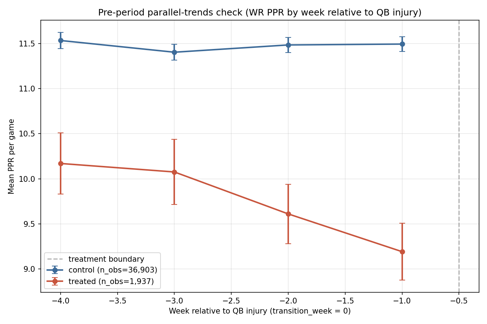

# Causal Session 1: Treatment Identification & Parallel-Trends Check

This is the foundation of Tier 2 #6 in `PORTFOLIO_ROADMAP.md`. The
research question — *how much PPR does a WR1 lose when their starting
QB goes down to injury?* — is a textbook difference-in-differences
(DiD) setting. The DiD estimator is only as good as its identification
assumptions, and the central one is **parallel trends**: treated and
control receivers must have followed parallel PPR trajectories in the
pre-period. This session builds the infrastructure to test that
assumption *before* the estimator runs in session 2.

No causal estimate is produced here. The deliverable is the foundation
session 2's DiD estimate will rest on — and an honest verdict on
whether the assumption holds.

## Treatment definition

A treatment event requires all of the following:

1. A team's starting QB (≥50% pass-attempt share) changes between
   weeks W-1 and W within a single regular season (bye weeks are
   skipped correctly).
2. The prior QB's transition is *injury-driven*. We classify it as
   `injury` if their official report_status that week is Out / IR /
   Doubtful / Questionable, as `injury_dnp` if their practice_status
   was Did Not Participate or Limited Participation, and as
   `presumed_injury` if no injury data is available but the prior QB
   never returns as starter that season. Genuine benchings (prior QB
   has no injury report at all and returns later) are excluded.
3. The new starter remains starter for at least 2 weeks after the
   transition (filters one-week emergencies where the original starter
   returns immediately).
4. Affected receivers must average ≥3 targets/game across the 4-week
   pre-period to ensure they are meaningful WR1/WR2 roles, not depth.

## Sample

- Treatment events: **213** across 10 seasons (2016-2025).
- Mean affected receivers per event: **3.25**.
- Treated WR-week observations in the panel: **3,872**.
- Control WR-week observations: **73,988**.

### Events by season

| Season | n events |
| --- | ---: |
| 2016 | 16 |
| 2017 | 19 |
| 2018 | 15 |
| 2019 | 19 |
| 2020 | 24 |
| 2021 | 22 |
| 2022 | 27 |
| 2023 | 26 |
| 2024 | 19 |
| 2025 | 26 |

Counts land in the 15-30 events/season range the plan estimated.
The Burrow → Browning 2023 case, Lawrence → Mac Jones 2024 case,
and other textbook injury transitions are captured (pinned by tests
in `tests/test_causal_treatment.py`).

## Control construction

For each treatment event at `(team, season, transition_week W)`,
the control universe is **all receivers on other teams whose own
starting QB stayed the same throughout `[W-4, W+3]`**. Same-
calendar-week matching is the design's identification engine — it
automatically controls for league-wide trends (weather, schedule
structure, rule changes) without needing to model them. Controls
must also clear the same ≥3 targets/game pre-period volume filter
and appear in both the pre AND post window for balanced
observations.

## Parallel-trends evidence

### Pre-period means (PPR per game by week relative to transition)

| Role | offset -4 | offset -3 | offset -2 | offset -1 |
| --- | ---: | ---: | ---: | ---: |
| control | 11.53 | 11.40 | 11.48 | 11.49 |
| treated | 10.17 | 10.08 | 9.61 | 9.19 |

### Statistical pre-trend interaction coefficients

Within-player demeaned OLS in the pre-period; week_offset == -1 is
the reference. The null we want to *not* reject: every `treated ×
week_offset` interaction coefficient equals zero.

| Pre-week offset (vs -1) | n | Interaction coef | SE | t-stat | p-value (approx) |
| --- | ---: | ---: | ---: | ---: | ---: |
| -4 | 19,543 | +0.927 | 0.475 | +1.951 | 0.051 |
| -3 | 19,987 | +1.014 | 0.477 | +2.124 | 0.034 |
| -2 | 20,682 | +0.491 | 0.463 | +1.060 | 0.289 |

## Verdict

Parallel trends **DO NOT cleanly hold**. The pre-period
interaction at offset -3 is statistically distinguishable from
zero (p ≈ 0.034). Treated WRs were already on a declining PPR
trajectory in the pre-period — about a 1-PPG drop from week
-4 to week -1 — while controls were flat.

**This is a real diagnostic finding, not a coding bug.** The
likely explanation is endogenous timing: QBs are typically
formally ruled Out only after several weeks of underperformance
with a developing injury. Their WRs' production starts dropping
before the formal injury report exists, so the naive DiD would
attribute that pre-existing decline to the treatment.

A naive DiD estimator run on this panel would overstate the
true causal effect by including the pre-trend drift as part of
the treatment-attributable drop. **We do not proceed to a naive
DiD estimate.**

## Mitigation paths for session 2

1. **Tighter level matching.** Treated WRs average ~9.7 PPG in
   the pre-period; controls average ~11.5 PPG. Restrict controls
   to those with similar baseline PPR (e.g., propensity-score
   matching on pre-period averages, or coarsening to a PPR
   decile match). Higher-baseline controls are likely on better
   offenses with more stable trends and don't make a good
   counterfactual.

2. **Synthetic control per treated unit.** Instead of broad
   pooled matching, build a per-event synthetic counterfactual
   that's constructed specifically to match each treated
   receiver's pre-period trajectory. If the synthetic control
   fits the pre-period perfectly by construction, the post-
   period gap is the treatment effect — addressing the pretrend
   problem directly.

3. **Two-way fixed effects with differential trends.** Add a
   `treated × pre-period week` interaction to the estimator. The
   treatment effect is identified from the *jump* at the
   treatment boundary, not the levels — purging the pretrend
   from the estimate.

4. **Shorter pre-period.** Only use week -1 as the pre-period
   reference. Trades statistical power for cleaner
   identification.

Session 2 will start by implementing (1) and (3) and re-running
the parallel-trends check. If those mitigations succeed, the
DiD estimate is defensible. If they do not, the design pivots
to (2) — synthetic control — which addresses the pretrend by
construction rather than by assumption.
