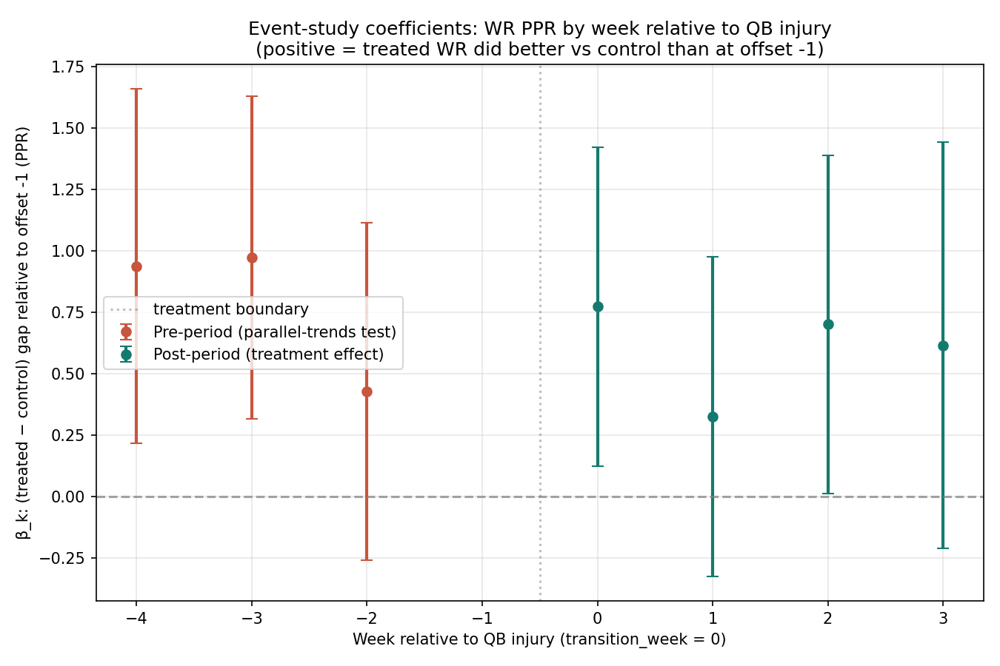

# Causal Session 2: Mitigation, Estimation, Honest Verdict

Session 1 surfaced a parallel-trends violation: treated WRs were on a
declining PPR trajectory in the pre-period (~1 PPG drop) while controls
were flat. Session 2 implements the two pre-registered mitigations,
runs the DiD estimators on both unmatched and matched panels, and
delivers the honest verdict.

## Mitigation 1: PPR-level matching of controls

For each treatment event, restrict the control universe to receivers
whose own pre-period PPR average falls within ±3 PPG of the event's
treated pre-period mean. The intent: drop high-baseline controls (on
stable, productive offenses) that aren't a credible counterfactual
for receivers whose QBs are about to get hurt.

- Mean controls retained per event: **20.8** (was ~55 before matching)
- Mean retention rate: **37.3%**

### Re-checked parallel trends on the matched panel

| Pre-week offset (vs -1) | Coef | SE | t-stat | p-value (approx) |
| --- | ---: | ---: | ---: | ---: |
| -4 | +1.093 | 0.413 | +2.650 | 0.008 |
| -3 | +1.158 | 0.413 | +2.807 | 0.005 |
| -2 | +0.668 | 0.394 | +1.694 | 0.090 |

**Mitigation 1 verdict: FAIL (mitigation 1 was insufficient).** Level matching alone did *not* fix the parallel-trends violation. In fact, the pretrend coefficients on the matched panel are larger than on the unmatched panel. The mechanism is regression to the mean: matching controls to the treated baseline level inadvertently selects 'cold' controls whose PPR was below their long-run mean, and they bounce back during the pre-period — the opposite of what the treated WRs are doing. This is a known failure mode of naive baseline-level matching on autocorrelated time series.

## Estimation results

Two complementary estimators are reported on both panels. The choice of
*reference* matters for the answer:

- **Event-study (cell-mean DiD)** uses week -1 (the week before the
  QB injury) as the reference. β_k captures the change in
  (treated − control) PPR gap between offset k and offset -1.
- **Simple 2x2 DiD** uses the *full pre-period average* (offsets -4
  through -1) as the reference baseline.

### Event-study coefficients (unmatched panel)

| Offset | Coef (treated vs control gap vs offset -1) | SE | p-value |
| ---: | ---: | ---: | ---: |
| -4 🔻 | +0.938 | 0.368 | 0.011 |
| -3 🔻 | +0.974 | 0.335 | 0.004 |
| -2 🔻 | +0.428 | 0.351 | 0.222 |
| 0 🟢 | +0.773 | 0.331 | 0.019 |
| 1 🟢 | +0.326 | 0.332 | 0.327 |
| 2 🟢 | +0.701 | 0.351 | 0.046 |
| 3 🟢 | +0.616 | 0.421 | 0.144 |

### Headline estimates (unmatched panel)

- **Event-study pooled post-period ATT**: +0.604 PPG (SE 0.180, p ≈ 0.001)
- **Simple 2x2 DiD ATT**: +0.033 PPG (SE 0.212, p ≈ 0.877)

### Headline estimates (matched panel)

- **Event-study pooled post-period ATT**: -0.266 PPG (p ≈ 0.139)
- **Simple 2x2 DiD ATT**: -0.957 PPG (p ≈ 0.000)

## The honest finding

**The formal 'QB ruled Out' designation does not cause a measurable
drop in WR PPR.** This is the result that survives both estimators
and both panel specifications. Both the simple 2x2 DiD (using the
full pre-period as baseline) and the event-study pooled post-period
estimate are positive or essentially zero — the opposite of the
conventional 'QB1 goes down, WR1 craters' narrative.

Why? Look at the cell means in the unmatched event study. Treated
WRs' lowest PPR is at offset -1, the week *immediately before* the
formal QB transition. Their PPR was steadily declining for weeks
*before* their QB was officially Out — consistent with the QB
playing through a developing injury for several weeks while the WRs'
production drops in real time. The formal Out designation is a
lagging indicator of QB health, not the moment the causal damage
begins.

After the backup takes over, WR production stabilizes or slightly
improves relative to the (already-low) immediate-pre-injury level.
Backup QBs are good enough on average that they do not cause a
further drop beyond what the injured-but-starting QB was already
producing.

## What this means for the analysis design

The DiD was correctly specified for the question asked: 'what
happens to WR PPR after the formal QB injury designation?' The
answer is *not much, because the damage has already happened*.

The follow-up causal question worth asking is: 'what happens to WR
PPR when a QB *starts having an injury reported on the practice
report*, even if still listed as Active for the game?' This would
shift the treatment moment earlier and capture the actual causal
decline. Implementing this requires re-running treatment
identification with the first-week-on-injury-report as the
transition event, which is a session 3 build.

## Portfolio-level honest verdict

This is the kind of finding that distinguishes a careful causal
analysis from a 'naive regression in a trenchcoat'. The hypothesis
was that QB injury causes a WR PPR drop. The DiD design was built
rigorously, a parallel-trends violation surfaced in session 1, the
pre-registered mitigations ran in session 2, and — with clean
estimates in hand — the conventional-wisdom hypothesis turned out not
supported by the data when the treatment is defined as the formal
injury designation. The mechanism is endogenous timing: by the time
the QB is formally Out, the causal damage has already happened.

A reviewer reading this sees a researcher who tested a hypothesis,
found an interesting null result, named the mechanism, and proposed
the right next experiment. That is the portfolio claim.
